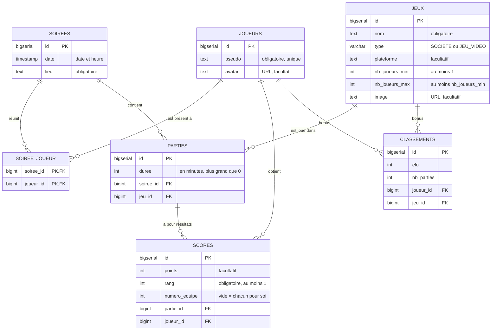

# Modèle de données – PlayNight

Ce document fixe le schéma de la base avant l'écriture des scripts SQL (`back-skeleton/initdb/`).
Il sert de référence commune pour le SQL, les entités JPA et les DTO.

## Schéma

## Tables

### `joueurs`
| Colonne | Type SQL | Type Java | Contraintes |
|---|---|---|---|
| id | BIGSERIAL | Long | clé primaire |
| pseudo | TEXT | String | obligatoire, unique |
| avatar | TEXT | String | facultatif (URL d'une image) |

### `jeux`
| Colonne | Type SQL | Type Java | Contraintes |
|---|---|---|---|
| id | BIGSERIAL | Long | clé primaire |
| nom | TEXT | String | obligatoire |
| type | VARCHAR | enum `TypeJeu` | obligatoire, `SOCIETE` ou `JEU_VIDEO` (`@Enumerated(EnumType.STRING)`) |
| plateforme | TEXT | String | facultatif (surtout pour les jeux vidéo : PC, Switch, PS5…) |
| nb_joueurs_min | INT | Integer | obligatoire, au moins 1 |
| nb_joueurs_max | INT | Integer | obligatoire, au moins `nb_joueurs_min` |
| image | TEXT | String | facultatif (URL) |

### `soirees`
| Colonne | Type SQL | Type Java | Contraintes |
|---|---|---|---|
| id | BIGSERIAL | Long | clé primaire |
| date | TIMESTAMP | LocalDateTime | obligatoire (date et heure) |
| lieu | TEXT | String | obligatoire |

### `soiree_joueur` (joueurs présents à une soirée)
Table de liaison de la relation ManyToMany `Soiree` ↔ `Joueur`. Il n'y a pas d'entité Java pour cette table : elle est gérée par `@JoinTable`, comme `student_course` dans l'exemple.

| Colonne | Type SQL | Contraintes |
|---|---|---|
| soiree_id | BIGINT | clé étrangère vers `soirees` |
| joueur_id | BIGINT | clé étrangère vers `joueurs` |

Clé primaire : le couple (`soiree_id`, `joueur_id`). Un joueur ne peut donc pas être présent deux fois à la même soirée.

### `parties`
| Colonne | Type SQL | Type Java | Contraintes |
|---|---|---|---|
| id | BIGSERIAL | Long | clé primaire |
| duree | INT | Integer | obligatoire, en minutes, plus grand que 0 |
| soiree_id | BIGINT | `Soiree` (ManyToOne) | obligatoire |
| jeu_id | BIGINT | `Jeu` (ManyToOne) | obligatoire |

### `scores` (entité d'association `Partie` ↔ `Joueur`)
| Colonne | Type SQL | Type Java | Contraintes |
|---|---|---|---|
| id | BIGSERIAL | Long | clé primaire |
| points | INT | Integer | facultatif (certains jeux n'ont qu'un classement) |
| rang | INT | Integer | obligatoire, au moins 1 (1 = vainqueur) |
| numero_equipe | INT | Integer | facultatif : vide pour une partie en chacun pour soi |
| partie_id | BIGINT | `Partie` (ManyToOne) | obligatoire |
| joueur_id | BIGINT | `Joueur` (ManyToOne) | obligatoire |

Le couple (`partie_id`, `joueur_id`) est unique : un joueur n'a qu'un seul score par partie.

**Parties en équipe** : chaque joueur a sa ligne, avec son `numero_equipe`. Les membres d'une même équipe ont le même rang (et les mêmes points). Exemple pour un 2v2 gagné par l'équipe 1 :

| joueur | numero_equipe | rang | points |
|---|---|---|---|
| Léa | 1 | 1 | 4 |
| Max | 1 | 1 | 4 |
| Tom | 2 | 2 | 2 |
| Sam | 2 | 2 | 2 |

### `classements` (bonus, à créer plus tard)
| Colonne | Type SQL | Type Java | Contraintes |
|---|---|---|---|
| id | BIGSERIAL | Long | clé primaire |
| elo | INT | Integer | obligatoire, 1000 au départ |
| nb_parties | INT | Integer | obligatoire, 0 au départ |
| joueur_id | BIGINT | `Joueur` (ManyToOne) | obligatoire |
| jeu_id | BIGINT | `Jeu` (ManyToOne) | obligatoire |

Le couple (`joueur_id`, `jeu_id`) est unique : un seul classement par joueur et par jeu.

## Règles de suppression

| On supprime… | Conséquence | En SQL |
|---|---|---|
| une soirée | ses parties, leurs scores et la liste des présents sont supprimés aussi | `ON DELETE CASCADE` sur `parties.soiree_id`, `scores.partie_id`, `soiree_joueur.soiree_id` |
| une partie | ses scores sont supprimés aussi | `ON DELETE CASCADE` sur `scores.partie_id` |
| un jeu déjà joué | **refusé** (sinon l'historique serait faussé) | pas de cascade sur `parties.jeu_id` |
| un joueur qui a des scores | **refusé** | pas de cascade sur `scores.joueur_id` |
| un joueur sans score | accepté ; il est retiré des listes de présents | `ON DELETE CASCADE` sur `soiree_joueur.joueur_id` |

## Choix techniques

- **Identifiants en `BIGSERIAL` côté SQL et `Long` côté Java.** Le squelette utilise `SERIAL` (entier 32 bits) avec des `Long` (64 bits). Ça passe tant que Hibernate ne vérifie pas le schéma, mais pas avec `spring.jpa.hibernate.ddl-auto=validate`.
- **Noms** : tables au pluriel et en `snake_case` (`nb_joueurs_min`), attributs Java en `camelCase` (`nbJoueursMin`), avec `@Column(name = "...")` quand les deux diffèrent.
- **Type de jeu** : enum Java `TypeJeu { SOCIETE, JEU_VIDEO }`, stocké sous forme de texte en base.
